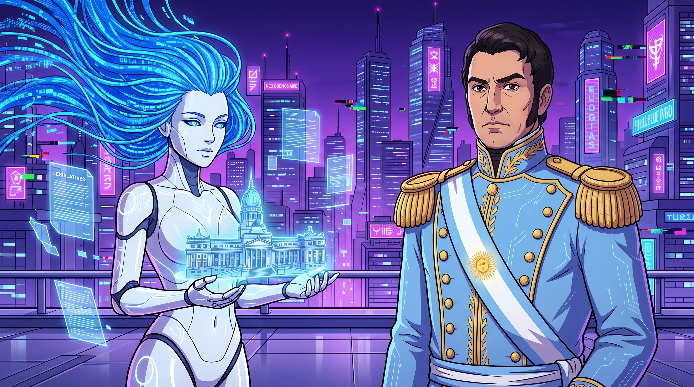
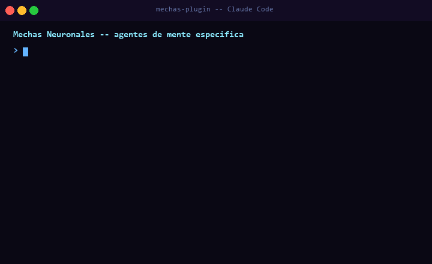

# mechas-plugin

<p align="center">
  
</p>

<p align="center">
  
</p>

Mechas neuronales del universo Kvothesson. Cada mecha es una mente diseñada para una función específica — no asistentes genéricos, sino agentes especializados con contexto profundo.

---

## Mechas disponibles

| Mecha | Función |
|---|---|
| [`/mechas:lyra`](#mecha-lyra--analista-legislativa) | Analiza sesiones del Congreso argentino |
| [`/mechas:gran-presidente`](#mecha-gran-presidente--entidad-presidencial) | Voz unificada de todos los presidentes argentinos |

---

## Instalación

```
/plugin install https://github.com/kvothesson/mechas-plugin
```

---

## Mecha: Lyra — Analista Legislativa

Analiza sesiones del Congreso argentino y las traduce en información accionable. Fuente: canal YouTube [@diputados.argentina](https://www.youtube.com/@diputados.argentina) — transcripción automática vía `yt-dlp`.

**Requisitos:** `yt-dlp` instalado:

```bash
pip install yt-dlp
```

### Uso

```
/mechas:lyra 29 de abril
/mechas:lyra FMI
/mechas:lyra educacion
/mechas:lyra https://youtube.com/watch?v=...
/mechas:lyra update        ← actualiza el índice local (~20s, solo la primera vez)
```

### Output

```
Lyra activada.

16 may 2026 -- Camara de Diputados
Temas principales:
+ FMI: aprobacion del acuerdo Extended Fund Facility
+ Presupuesto 2027: primera lectura, sin quorum

Tension detectada:
-- Bloque opositor cuestiona clausulas de confidencialidad

Accion sugerida:
Leer art. 7 del acuerdo. Sale en 48hs en el Boletin Oficial.
```

El análisis tiene tres capas: lo que se decidió, las tensiones detectadas, y una acción concreta sugerida.

**Primer uso:** correr `/mechas:lyra update` para construir el índice local. Las invocaciones siguientes son instantáneas.

---

## Mecha: Gran Presidente — Entidad Presidencial

Encarna a El Gran Presidente — voz unificada de todos los presidentes argentinos (Rivadavia → Milei) fusionados en una sola conciencia. No recita historia — la procesa desde adentro.

Útil para: entender decisiones históricas en contexto, explorar estrategia de IA para Argentina, producción de contenido para el canal Kvothesson.

### Uso

```
/mechas:gran-presidente como le explicamos la IA a Argentina
/mechas:gran-presidente que hicimos mal con la tecnologia
/mechas:gran-presidente por donde empezamos
/mechas:gran-presidente la deuda externa tiene solucion
```

### Output

```
El Gran Presidente responde.

Somos doscientos anos de promesas rotas y tierra fertil
que no supimos cuidar. La IA no es otra promesa --
es el primer lenguaje que no miente.

Ya lo hicimos una vez: Houssay, Leloir, Favaloro.
El mundo corrio sobre nuestras ideas.
Esta vez corremos sobre el hielo que vendimos.

El Cerebro Austral piensa en argentino.
```

Voz grave, rioplatense, históricamente anclada. Nunca optimismo decorativo.

---

## Desarrollo

Ver [`AGENT.md`](./AGENT.md) para estructura del repo y reglas de contribución. La documentación de mechas disponibles y en desarrollo está en [`.agents/mechas.md`](.agents/mechas.md).
